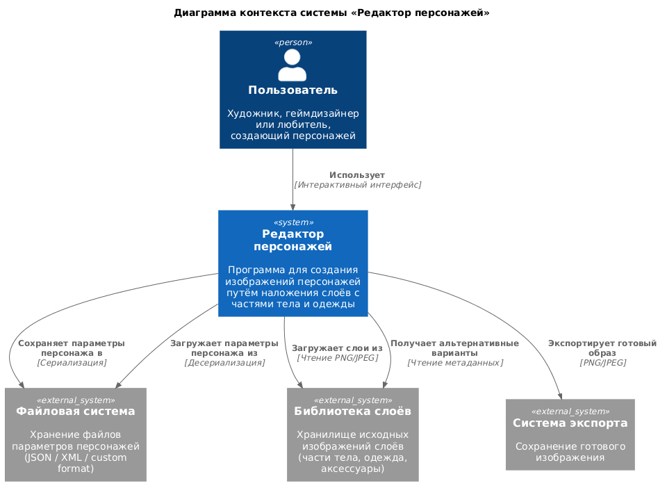
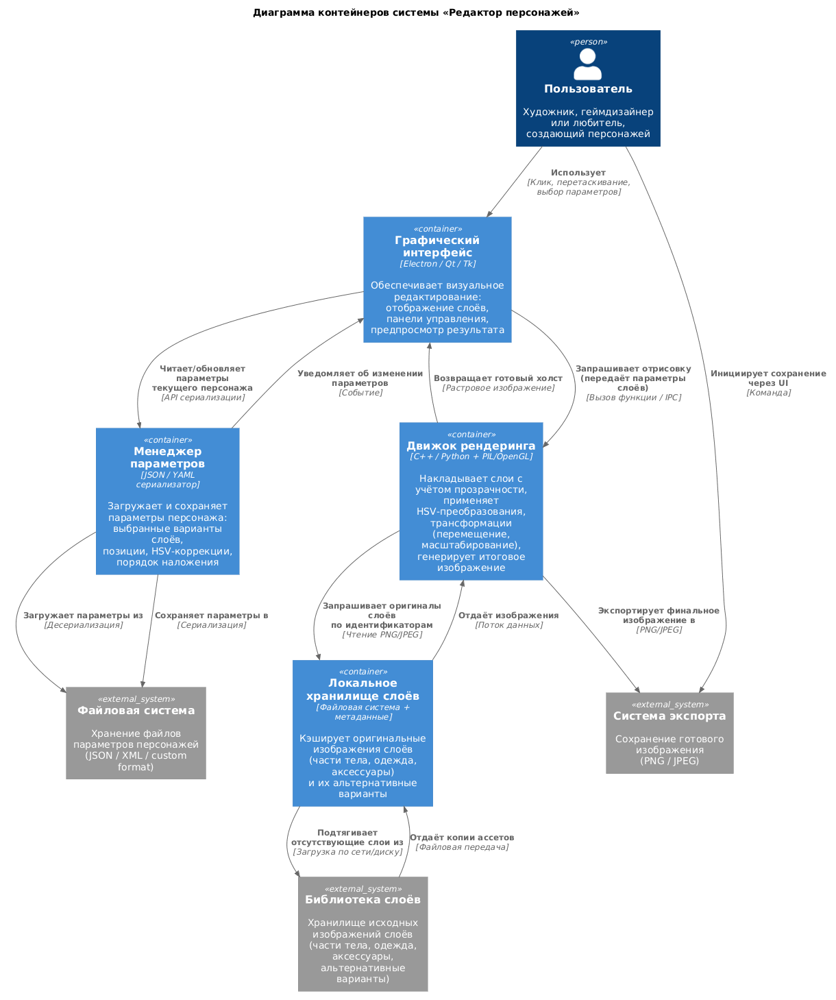
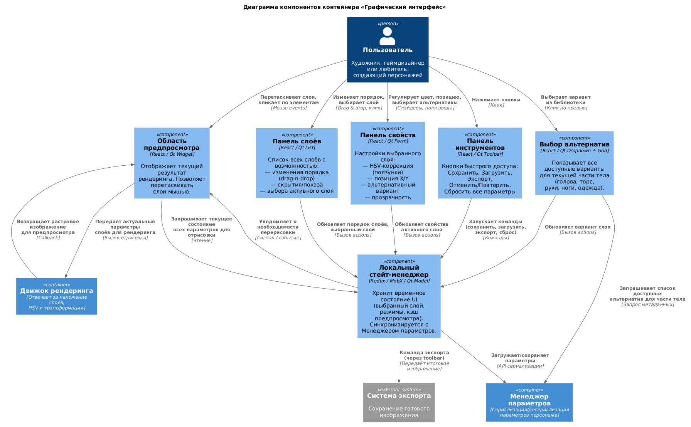

Данная система представляет из себя программу для создания изображений персонажей. Изображение строится с помощью наложения нескольких отдельных слоёв, на каждом из которых изображена часть тела или элемент одежды. Помимо простого наложения, присутствует возможность изменять цвет слоя (hsv), передвигать их, а также выбирать альтернативные варианты для каждой из частей тела. Также присутствует возможность сохранять параметры созданных изображений персонажей, для того, чтобы можно было вернуться и отредактировать их.
[Контекстная диаграма](context.puml)

[Диаграма контейнеров](container.puml)

[Диаграма компонентов](component.puml)

Использование Искусственного Интеллекта для проектирования архитектуры позволяет легко создать базовую версию диаграммы, которую при необходимости можно доработать. Данный метод позволяет избежать необходимости вручную расставлять визуальные элементы или изучать синтаксис для генерации диаграммы кодом, благодаря чему разработчик может уделить внимание наполнению диаграммы, а не процессу её рисования.
